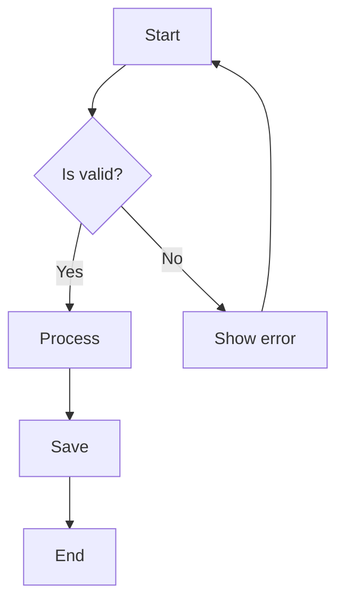
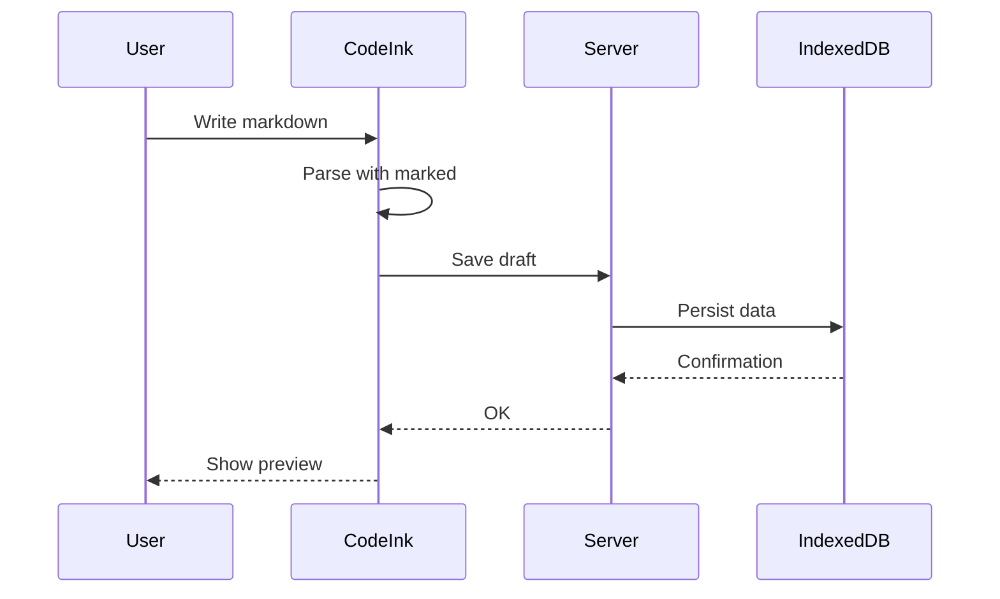
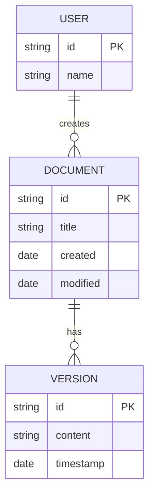
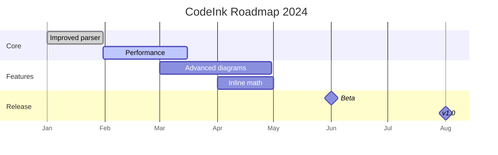
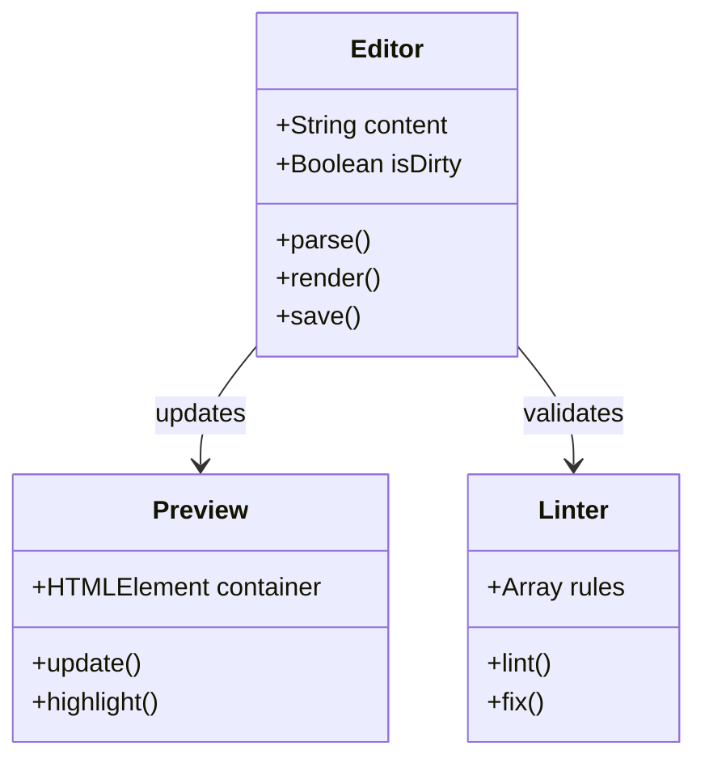

# CodeInk — Complete Markdown Editor Guide

## Table of Contents

1. [Introduction](#1-introduction)
2. [Quick Installation](#2-quick-installation)
3. [Basic Syntax](#3-basic-syntax)
4. [Advanced Syntax](#4-advanced-syntax)
5. [Diagrams with Mermaid](#5-diagrams-with-mermaid)
6. [Math with KaTeX](#6-math-with-katex)
7. [GitHub Alerts](#7-github-alerts)
8. [Extensions and Shortcuts](#8-extensions-and-shortcuts)
9. [Roadmap](#9-roadmap)
10. [References](#10-references)

---

## 1. Introduction

CodeInk is a real-time **Markdown** editor with instant rendering, designed for developers who need to document code, create diagrams, and write technical content elegantly.

### 1.1 Key Features

| Feature | Technology | Description |
|---------|------------|-------------|
| Syntax Highlighting | Shiki | Code highlighting with custom themes |
| Diagrams | Mermaid | Flowcharts, sequence, ERD, Gantt, and more |
| Math | KaTeX | LaTeX equation rendering |
| Alerts | GitHub-style | Visually highlighted alert blocks |
| Tables | GFM | Standard Markdown table formatting |
| Footnotes | GFM | References and citations |

### 1.2 Editor Architecture

```
┌─────────────────────────────────────────────────────────┐
│                    Editor (textarea)                    │
│              • Markdown source input                    │
└──────────────────────────┬──────────────────────────────┘
                           │ parse
                           ▼
┌─────────────────────────────────────────────────────────┐
│                    Parser (marked)                      │
│              • Markdown → AST → HTML                    │
└──────────────────────────┬──────────────────────────────┘
                           │ transform
                           ▼
┌─────────────────────────────────────────────────────────┐
│                   Transformers                          │
│  ┌──────────┐  ┌──────────┐  ┌──────────┐  ┌─────────┐  │
│  │   Shiki  │  │  KaTeX   │  │  Mermaid │  │  Alerts │  │
│  │  (code)  │  │  (math)  │  │(diagrams)│  │(callouts)│ │
│  └──────────┘  └──────────┘  └──────────┘  └─────────┘  │
└──────────────────────────┬──────────────────────────────┘
                           │ render
                           ▼
┌─────────────────────────────────────────────────────────┐
│                   Preview (DOM)                         │
│              • Interactive output                       │
└─────────────────────────────────────────────────────────┘
```

---

## 2. Quick Installation

> [!IMPORTANT]
> CodeInk is a **client-side only** application. All processing happens in your browser. Documents are saved locally via IndexedDB.

### 2.1 Requirements

| Requirement | Version |
|-----------|---------|
| Node.js | >= 18.0 |
| Bun | >= 1.0 |
| Browser | Chrome/Firefox/Edge/Safari latest versions |

### 2.2 Commands

```bash
# Clone repository
git clone https://github.com/username/codeink.git
cd codeink

# Install dependencies
bun install

# Start development server
bun run dev

# Build for production
bun run build
```

> [!TIP]
> Use `bun` instead of `npm` or `pnpm` for a faster experience. CodeInk is optimized for Bun.

---

## 3. Basic Syntax

### 3.1 Headings and Text

```markdown
# H1 - Main Title
## H2 - Section
### H3 - Subsection

**Bold text**
*Italic text*
~~Strikethrough text~~
`Inline code`
```

---

## 4. Advanced Syntax

### 4.1 Tables

| Language | Primary Use | Popularity |
|----------|-------------|------------|
| TypeScript | Frontend/Fullstack | ⭐⭐⭐⭐⭐ |
| Python | Data/ML/Backend | ⭐⭐⭐⭐⭐ |
| Rust | Systems/Performance | ⭐⭐⭐⭐ |
| Go | Backend/Cloud | ⭐⭐⭐⭐ |
| Zig | Systems/Embedded | ⭐⭐⭐ |

> [!NOTE]
> Tables in Markdown automatically align based on separator syntax (`---`, `:---`, `---:`).

### 4.2 Footnotes

CodeInk uses marked[^1] to parse Markdown and Shiki[^2] for syntax highlighting.

[^1]: [marked](https://marked.js.org/) — Fast and extensible parser
[^2]: [Shiki](https://shiki.style/) — Syntax highlighter based on TextMate

### 4.3 Links and Images

```markdown
[External link](https://example.com)
[Internal link](#section)

```

---

## 5. Diagrams with Mermaid

CodeInk supports **15+ diagram types** via Mermaid.

### 5.1 Flowchart



### 5.2 Sequence Diagram



### 5.3 ER Diagram



### 5.4 Gantt Chart



### 5.5 Class Diagram



---

## 6. Math with KaTeX

### 6.1 Inline Formulas

Inline: $E = mc^2$ — Einstein's famous equation.

Another example: $\sum_{i=1}^{n} x_i = x_1 + x_2 + \dots + x_n$

### 6.2 Block Formulas

$$
\int_{-\infty}^{\infty} e^{-x^2} dx = \sqrt{\pi}
$$

$$
\frac{d}{dx}\left( \int_{a(x)}^{b(x)} f(t) \, dt \right) = f(b(x)) \cdot b'(x) - f(a(x)) \cdot a'(x)
$$

$$
\begin{pmatrix}
a & b \\
c & d
\end{pmatrix}
\times
\begin{pmatrix}
e & f \\
g & h
\end{pmatrix}
=
\begin{pmatrix}
ae+bg & af+bh \\
ce+dg & cf+dh
\end{pmatrix}
$$

---

## 7. GitHub Alerts

CodeInk supports GitHub-style alerts to highlight important information:

> [!NOTE]
> Useful information that users should know, even when skimming.

> [!TIP]
> Helpful advice for doing things better or more easily.

> [!IMPORTANT]
> Key information users need to know to achieve their goal.

> [!WARNING]
> Urgent info that needs immediate user attention to avoid problems.

> [!CAUTION]
> Advises about risks or negative outcomes of certain actions.

---

## 8. Extensions and Shortcuts

### 8.1 Syntax Highlighting

```typescript
// TypeScript code example
interface Document {
  id: string
  title: string
  content: string
  updatedAt: Date
}

async function saveDocument(doc: Document): Promise<void> {
  const db = await openDB('codeink', 1)
  await db.put('documents', doc)
  console.log(`✅ Saved: ${doc.title}`)
}
```

```python
# Python code example
def fibonacci(n: int) -> list[int]:
    """Generate Fibonacci sequence up to n terms."""
    if n <= 0:
        return []
    
    fib = [0, 1]
    for i in range(2, n):
        fib.append(fib[i-1] + fib[i-2])
    
    return fib[:n]

# Usage
print(fibonacci(10))  # [0, 1, 1, 2, 3, 5, 8, 13, 21, 34]
```

```rust
// Rust code example
fn main() {
    let numbers = vec![1, 2, 3, 4, 5];
    
    let sum: i32 = numbers
        .iter()
        .filter(|&&x| x % 2 == 0)
        .sum();
    
    println!("Sum of evens: {}", sum);
}
```

---


## 9. Roadmap

### 9.1 Upcoming Features

- [x] Syntax highlighting with Shiki
- [x] Mermaid diagrams (15+ types)
- [x] KaTeX math
- [x] GitHub alerts
- [x] Tables and footnotes
- [ ] PDF export
- [ ] Custom themes
- [ ] Extensible plugins
- [ ] Vim/Emacs keybindings

---

## 10. References

- [Marked Documentation](https://marked.js.org/)
- [Shiki Syntax Highlighter](https://shiki.style/)
- [Mermaid Diagrams](https://mermaid.js.org/)
- [KaTeX Math](https://katex.org/)
- [GitHub Flavored Markdown](https://github.github.com/gfm/)

---

> [!CAUTION]
> CodeInk is under active development. Some features may change. Save your work frequently.

**Made with ❤️ for the developer community.**
