# Welcome to CodeInk

A real-time **Markdown editor** with syntax highlighting, diagrams and math.

---

## Code Highlighting

```typescript
interface User {
  id: string
  name: string
  email: string
}

async function fetchUser(id: string): Promise<User> {
  const res = await fetch(`/api/users/${id}`)
  if (!res.ok) throw new Error("User not found")
  return res.json()
}
```

```python
def fibonacci(n: int) -> list[int]:
    """Generate fibonacci sequence"""
    fib = [0, 1]
    for i in range(2, n):
        fib.append(fib[i-1] + fib[i-2])
    return fib

print(fibonacci(10))
```

```bash
#!/bin/bash
# Deploy script
echo "🚀 Building project..."
npm run build

if [ $? -eq 0 ]; then
  echo "✅ Build successful, deploying..."
  rsync -avz --delete ./dist/ user@server:/var/www/app/
  echo "🎉 Deployed!"
else
  echo "❌ Build failed" && exit 1
fi
```

```sql
-- Get top users by activity
SELECT
    u.name,
    u.email,
    COUNT(p.id) AS total_posts,
    MAX(p.created_at) AS last_post
FROM users u
LEFT JOIN posts p ON p.author_id = u.id
WHERE u.active = true
GROUP BY u.id, u.name, u.email
HAVING COUNT(p.id) > 5
ORDER BY total_posts DESC
LIMIT 10;
```

```go
package main

import (
	"fmt"
	"net/http"
)

func handler(w http.ResponseWriter, r *http.Request) {
	fmt.Fprintf(w, "Hello, %s!", r.URL.Path[1:])
}

func main() {
	http.HandleFunc("/", handler)
	fmt.Println("Server running on :8080")
	http.ListenAndServe(":8080", nil)
}
```

```java
import java.util.List;
import java.util.stream.Collectors;

public class App {
    record User(String name, int age) {}

    public static void main(String[] args) {
        var users = List.of(
            new User("Alice", 30),
            new User("Bob", 25),
            new User("Charlie", 35)
        );

        var adults = users.stream()
            .filter(u -> u.age() >= 30)
            .map(User::name)
            .collect(Collectors.toList());

        System.out.println("Adults: " + adults);
    }
}
```

## Math with KaTeX

Inline math: $E = mc^2$

Block math:

$$
\int_{-\infty}^{\infty} e^{-x^2} dx = \sqrt{\pi}
$$

## GitHub Alerts

> [!TIP]
> Use keyboard shortcuts to speed up your workflow.

> [!WARNING]
> This is a client-side only application. Your content is not saved to any server.

> [!NOTE]
> CodeInk supports all GitHub Flavored Markdown features.

## Tables

| Feature | Status |
|---------|--------|
| Syntax Highlighting | Shiki |
| Diagrams | Mermaid |
| Math | KaTeX |
| Alerts | GitHub-style |
| Footnotes | Supported |

## Task List

- [x] Markdown rendering
- [x] Shiki syntax highlighting
- [x] Mermaid diagrams
- [x] KaTeX math
- [ ] Export to PDF
- [ ] Collaborative editing

## Footnotes

CodeInk uses marked[^1] for parsing and Shiki[^2] for syntax highlighting.

[^1]: [marked](https://marked.js.org/) - A markdown parser built for speed.
[^2]: [Shiki](https://shiki.style/) - A beautiful syntax highlighter.

---

## Mermaid Diagrams

### Flowchart

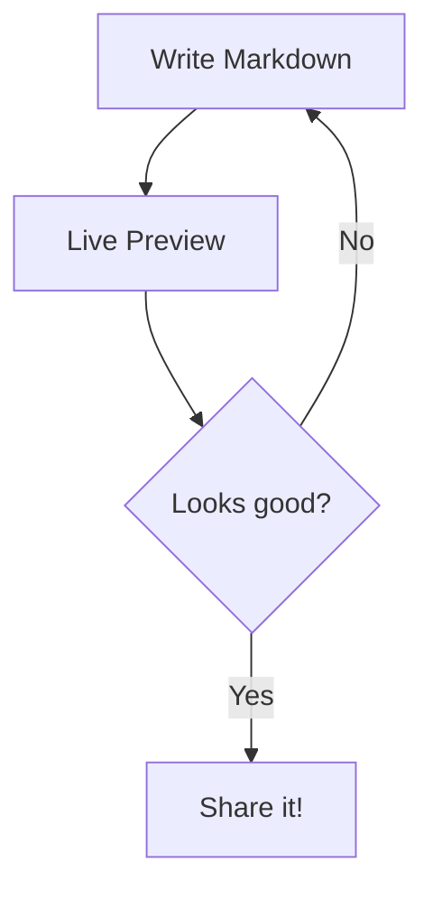

### Sequence Diagram

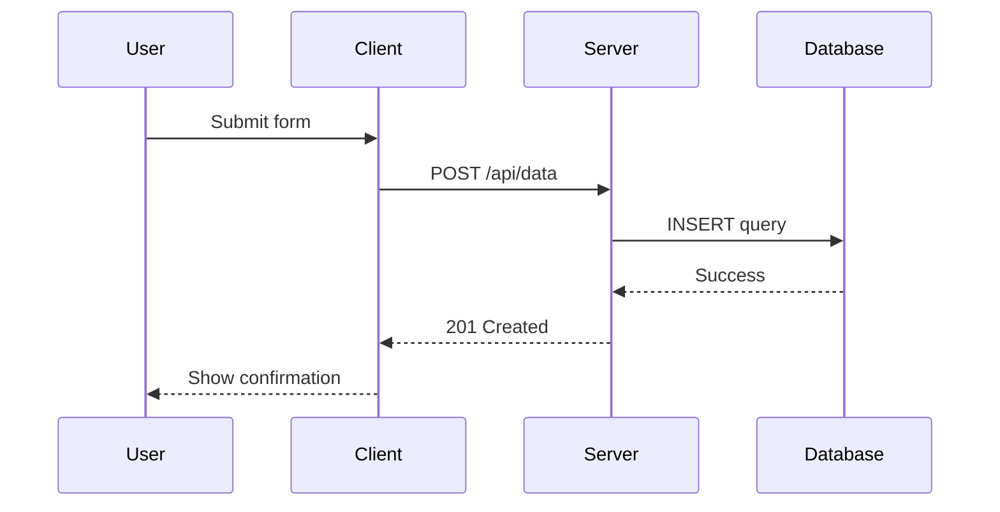

### Entity Relationship

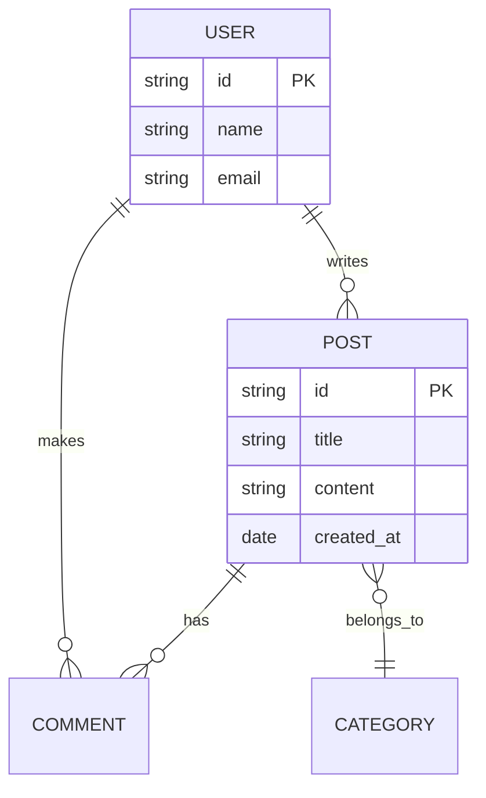

### Pie Chart

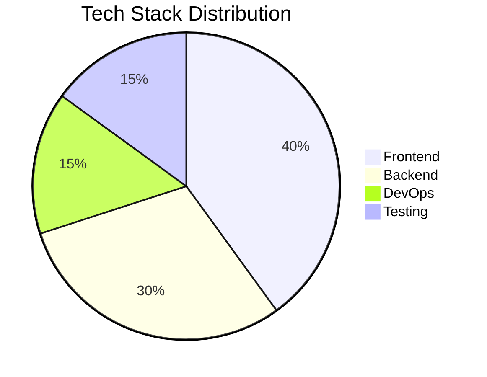

### Gantt Chart

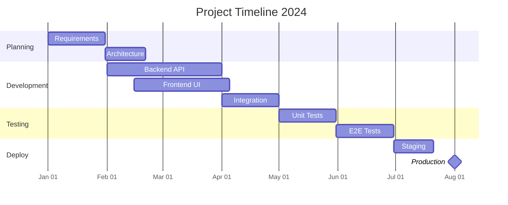

### Class Diagram

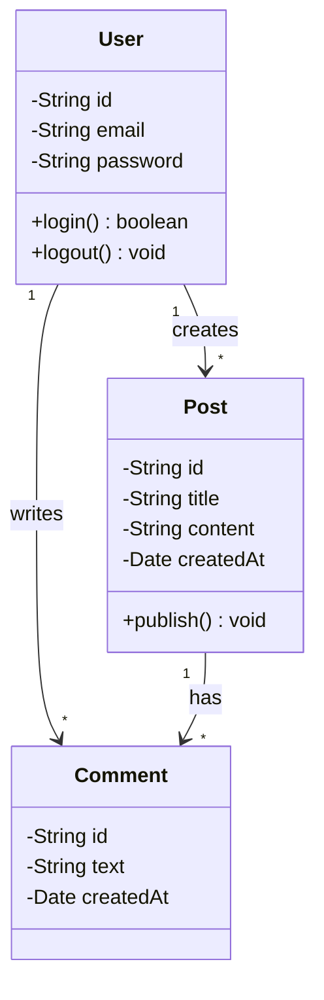

### State Diagram

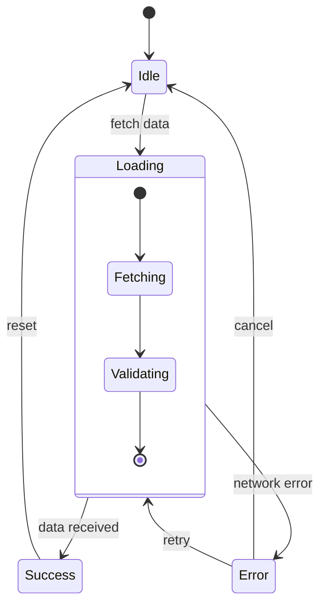

### User Journey

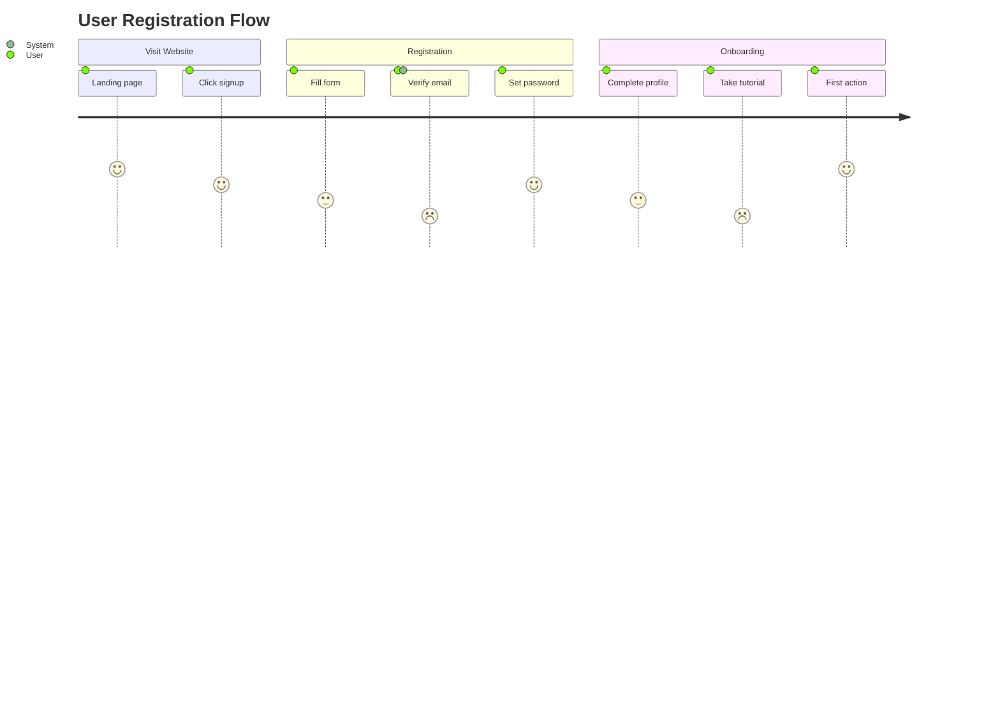

### Git Graph

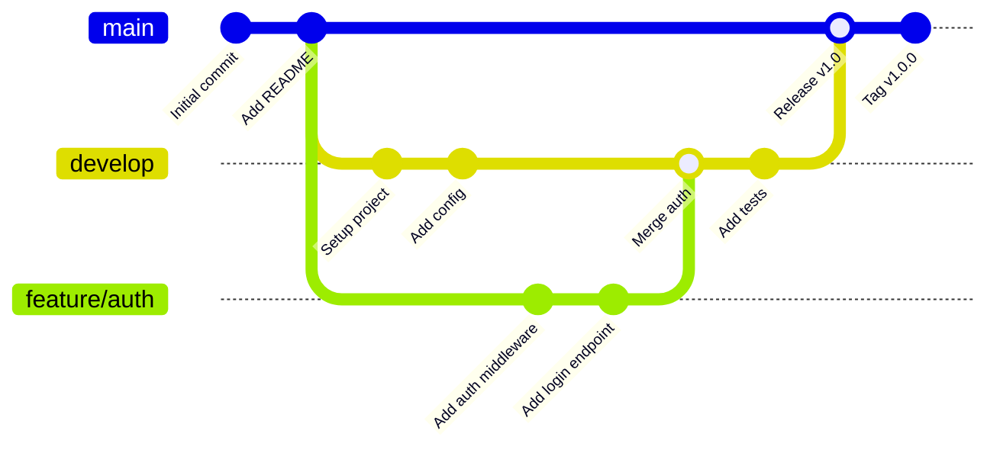

### Mindmap

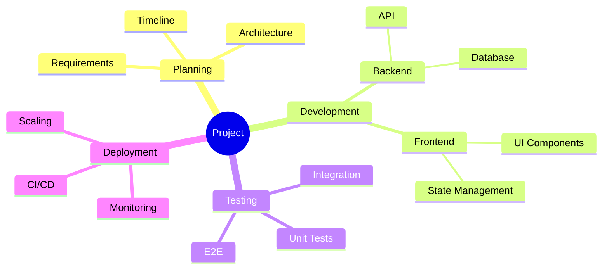

### Timeline

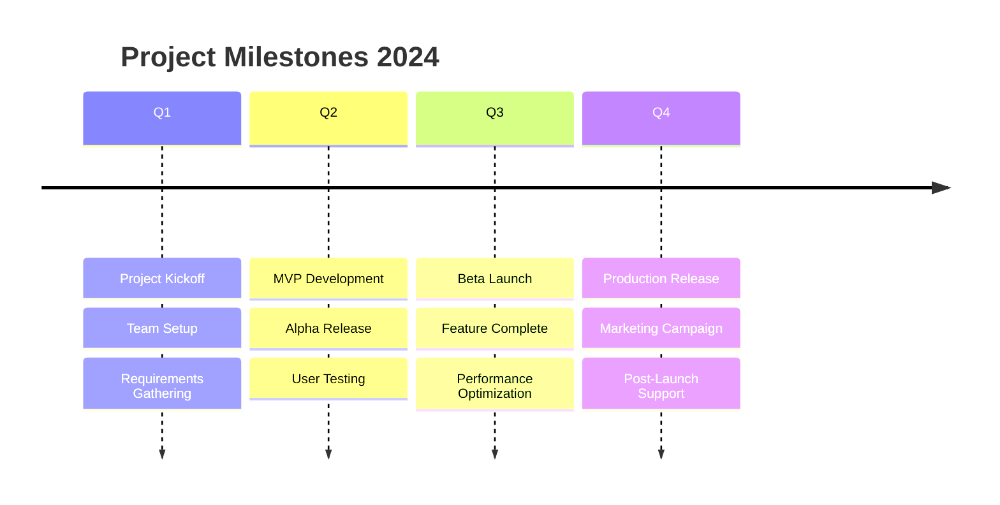

### Sankey Diagram

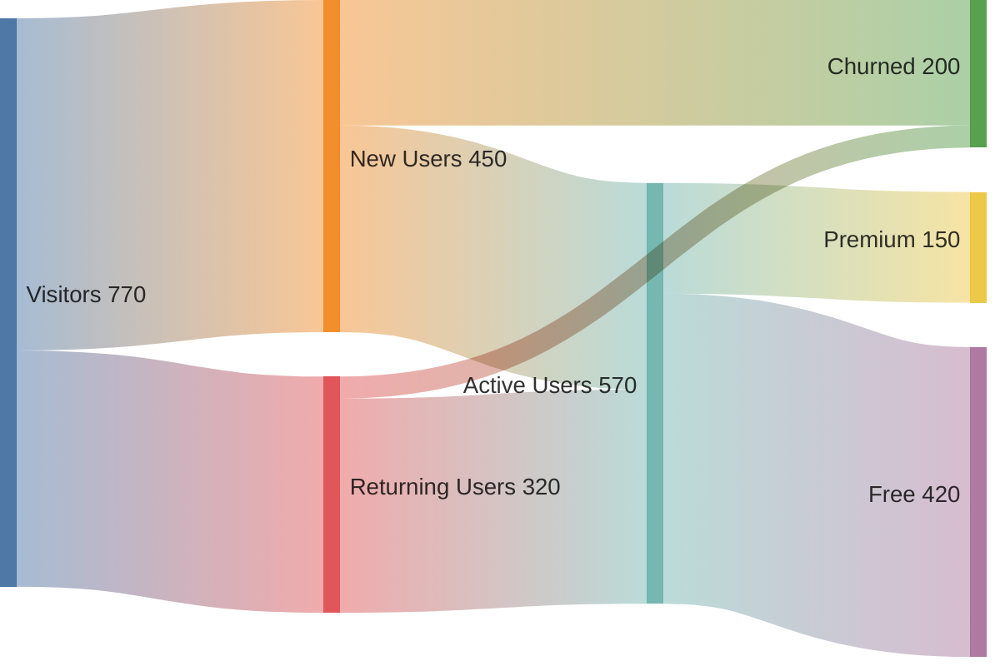

### Block Diagram

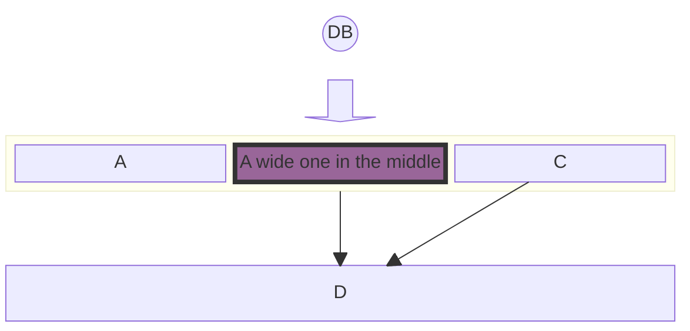

### Architecture Diagram

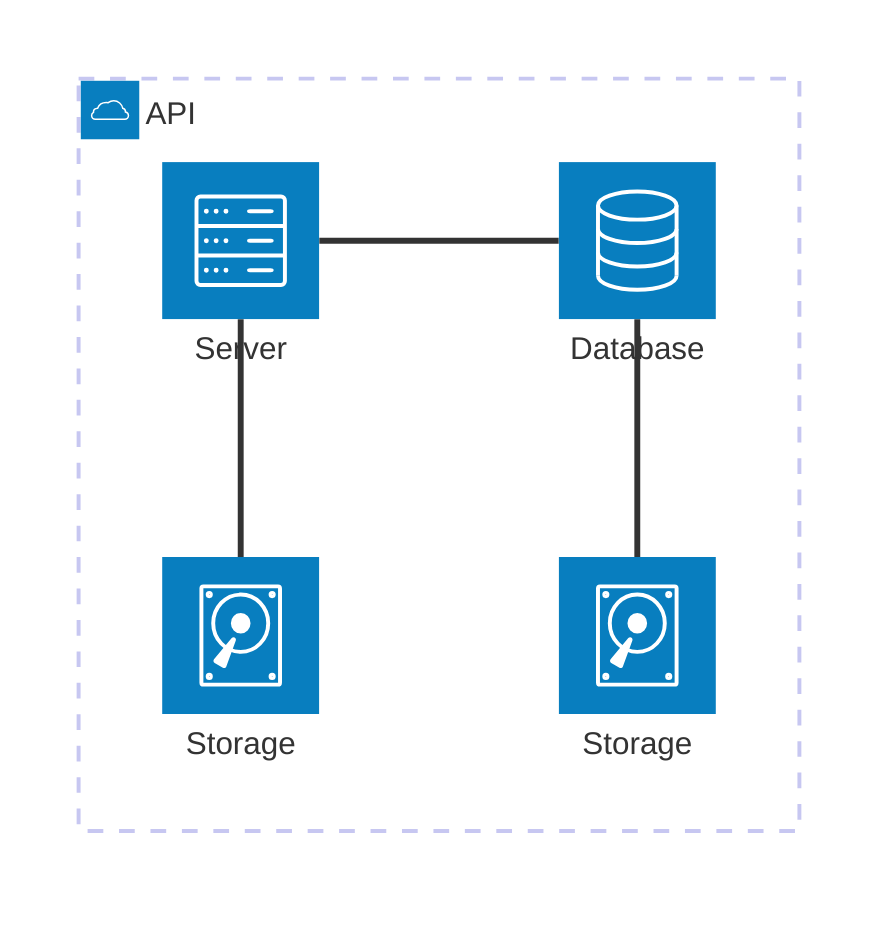

### XY Chart

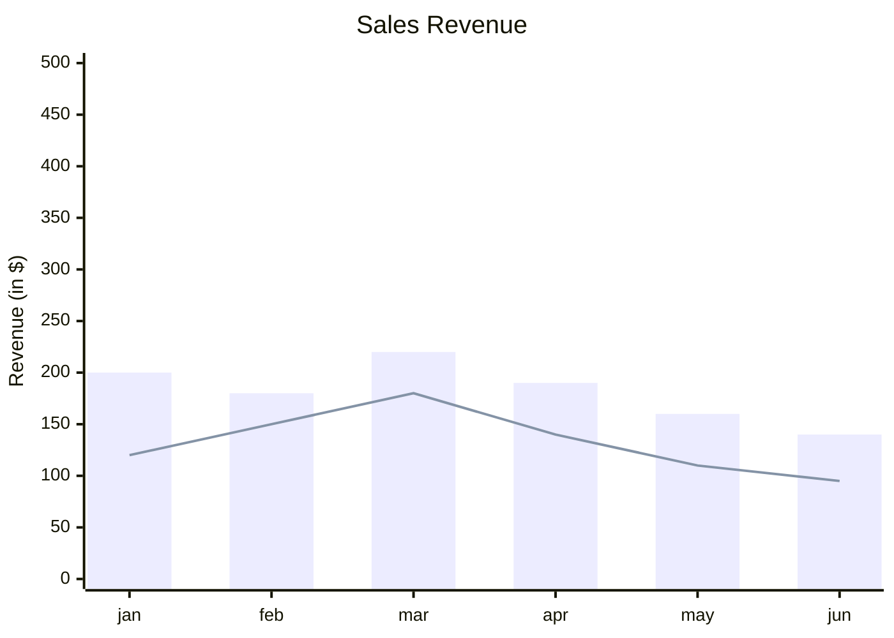
