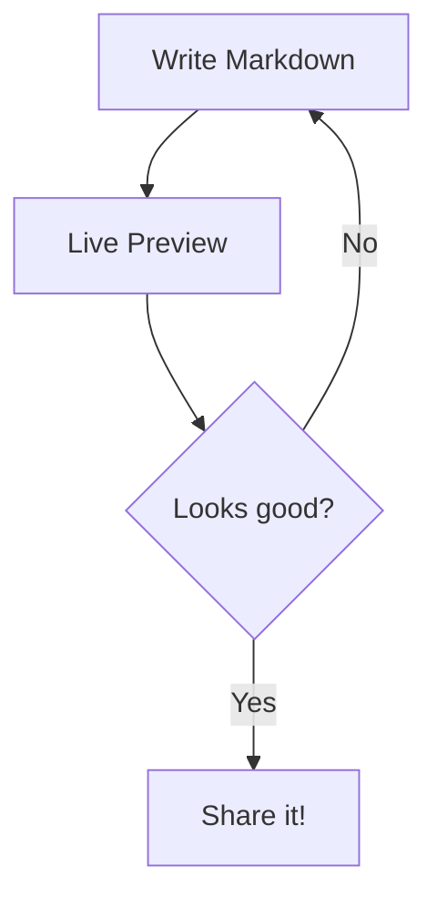

# Welcome to CodeInk

A real-time **Markdown editor** with syntax highlighting, diagrams, and math.

---

## Code Highlighting

```typescript
interface User {
  id: string
  name: string
  email: string
}

async function fetchUser(id: string): Promise<User> {
  const res = await fetch(`/api/users/${id}`)
  if (!res.ok) throw new Error("User not found")
  return res.json()
}
```

```python
def fibonacci(n: int) -> list[int]:
    """Generate fibonacci sequence"""
    fib = [0, 1]
    for i in range(2, n):
        fib.append(fib[i-1] + fib[i-2])
    return fib

print(fibonacci(10))
```

## Mermaid Diagrams



## Math with KaTeX

Inline math: $E = mc^2$

Block math:

$$
\int_{-\infty}^{\infty} e^{-x^2} dx = \sqrt{\pi}
$$

## GitHub Alerts

> [!TIP]
> Use keyboard shortcuts to speed up your workflow.

> [!WARNING]
> This is a client-side only application. Your content is not saved to any server.

> [!NOTE]
> CodeInk supports all GitHub Flavored Markdown features.

## Tables

| Feature | Status |
|---------|--------|
| Syntax Highlighting | Shiki |
| Diagrams | Mermaid |
| Math | KaTeX |
| Alerts | GitHub-style |
| Footnotes | Supported |

## Task List

- [x] Markdown rendering
- [x] Shiki syntax highlighting
- [x] Mermaid diagrams
- [x] KaTeX math
- [ ] Export to PDF
- [ ] Collaborative editing

## Footnotes

CodeInk uses marked[^1] for parsing and Shiki[^2] for syntax highlighting.

[^1]: [marked](https://marked.js.org/) - A markdown parser built for speed.
[^2]: [Shiki](https://shiki.style/) - A beautiful syntax highlighter.